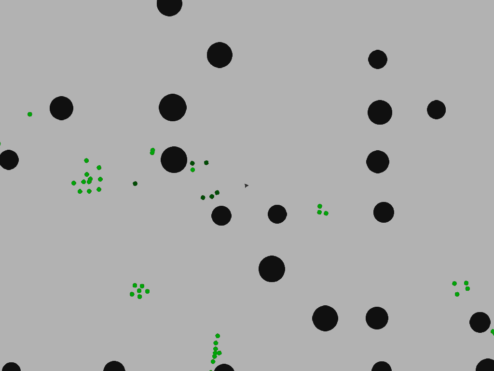
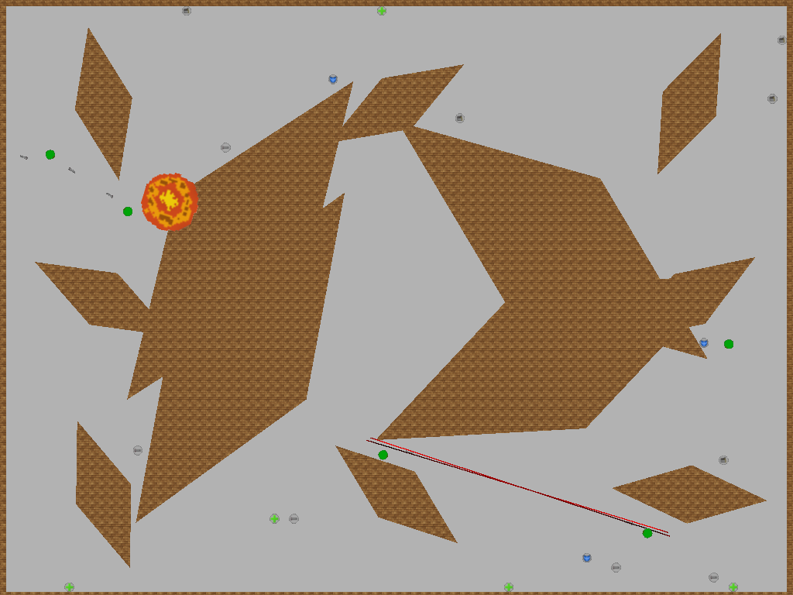
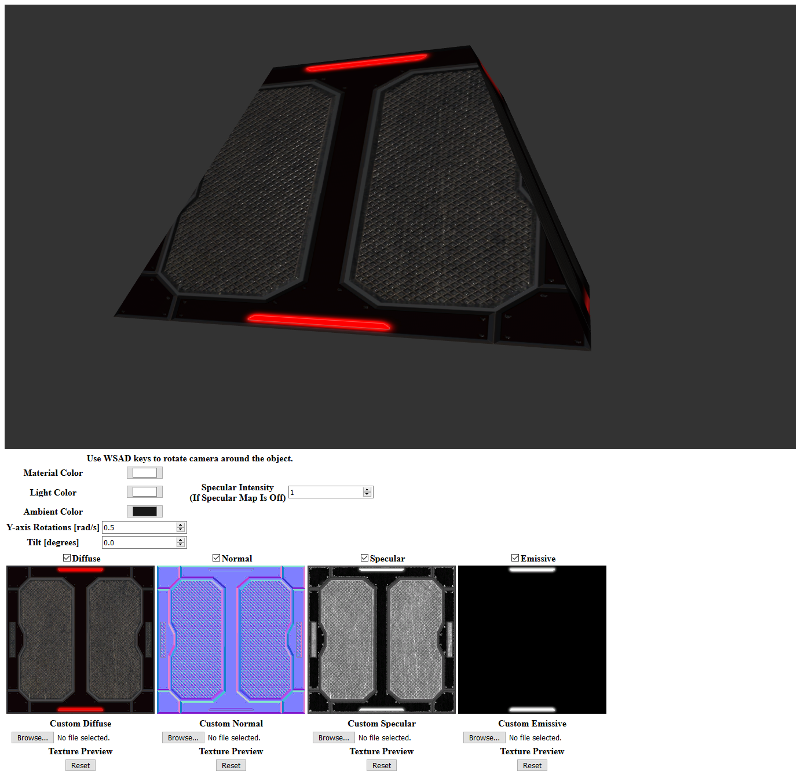

# Portfolio
Showcase of my works and contributions

# Projects 

 * [SGE - Simple Game Engine](https://github.com/xcodeassociated/SGE) - Prototype C++ Game Engine (Co-Creator)
 * [Zombie Game](https://github.com/TimPhoeniX/SGE_ZombieGame) - SGE-based tech demo focusing on Steering Behaviours
   

Screenshot

   
   
   
   

 * [Bots Demo](https://github.com/TimPhoeniX/SGE_CppBotsDemo) - SGE-based tech demo focusing on FSM-based AI
   

Screenshot

   
   
   
   

 * [WebGL2 rendering demo](https://github.com/TimPhoeniX/WebGL2Demo) ([Page](https://timphoenix.github.io/WebGL2Demo/)) - Low-level object rendering in WebGL2
   

Screenshot

   
   
   
   

